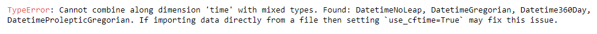

# Load CMIP or CESM Model Output Files on Keeling with Catalog

This tutorial is specifically for users who will use the File Catalog for either CMIP6 or CESM output. 

You should be able to access the catalogs nested in `/data/keeling/a/cristi` directory. Currently available catalogs are as follow:  

- CESM-LME-catalog: `/data/keeling/a/cristi/a/esm_data/cesm_catalog.csv`

- CESM-LE-catalog: `data/keeling/a/cristi/a/data/LENS_catalog.csv`

- CMIP6-catalog: `/data/keeling/a/cristi/a/esm_data/cmip6_catalog.csv`

**Prerequsites for the use of the catalog:** 
- Basic knowledge of Pandas and Xarray* 
- Knowledge about CMIP6 output and what the search keys are referring to**

 *Highly recommend using Xarray to deal with large datasets like global climate model output; but other packages would also work.  
** Check out [Step 2 in the Downloading CMIP5 and CMIP6 Models. nc Files page](download_cmip.md) for more details. 

 

## Introduction 
Your goal will be to load either CESM or CMIP6 files available on Cristi's `/a/` folder. With the catalog that listed all files, we want to 
    
1. Pinpoint our range of files
2. Get their filepaths, and 
3. Read the files 

Link to the sample Jupyter Notebook: [Loading from Catalog](./tutorials/loading_from_catalog.ipynb)

## Step 0: Start a Jupyter Notebook and import required packages 
This will be the notebook that you work with the model data. You will be needing `pandas` to **read and search within the catalog**, and `xarray` to view content of the `.nc` files. 

    import pandas as pd
    import xarray as xr

## Step 1: Load the Catalog 
    a=pd.read_csv('/data/keeling/a/cristi/a/esm_data/cmip6_catalog.csv')

Here, variable `cmip6` is now a pandas dataframe that contains all the information accessed from all CMIP6 files available in the `.../cristi/a/esm_data/cmip6` folder. 

We name the catalogs as '`cesm_catalog.csv`' and '`cmip6_catalog.csv`' respectively. You can switch out '`cmip6_catalog.csv`' to '`cesm_catalog.csv`' to access the CESM-output catalog. 

## Step 2: Search within the Catalog: 
    path=a.loc[(a['variable_id']=='hur')&  
           (a['experiment']=='AMIP')& 
           (a['source_id'].str.contains('GFDL'))]['path'].to_list()

To search within the dataframe, we use the `.loc` method.  

Here there are four conditions applied to filter the dataframe: 

1. Variable (variable_id)
2. Experiment (experiment)
3. Model Name (source_id)
4. Member Variant (variant_label)

These are the common search keys (i.e. pandas dataframe columns) you will use. However, there are more keys available, and you can check all of them by the follow: 

    a.columns

After narrowing down the range to all AMIP experiment relative humidity files from the GFDL models in this example, we will get the filepaths of those chosen files by calling `['path']`. We will have to change the object type to `list` instead of a `numpy array` before reading the files with Xarray. 

## Step 3: Read the Files 
    ds = xr.open_mfdataset(path,combine="by_coords")

This step is self-explanatory: `open_mfdataset` is called to read the files. 

'`combine='by_coords'`' is required when there are more than one files to be read. Using the same example, the AMIP-relative humidity files from GFDL model are broken down into 5-year sections for each `.nc` file within the entire 1979-2014 period, thus a total of 6 files. With `combine='by_coords'`, they will now be concatenated as **a single dataset** with time coordinates running from 1979 January to 2014 December. 

### **Note: Error will rise when have Multiple Models in `path`**
It will be awesome if we can simply include all models' filepaths and read as a single dataset. However, life is hard: Models have different time coordinates, such as `cftime.Datetime360Day()` from `cftime` and `datetime64` from `NumPy`. You will run into the following error if you try to load multiple model output for a single variable altogether. 

It is unclear whether there is a certain preferred time coordinates. So the simplest practice is to **read output files for a single model and variable one at a time**. You can change the time coordinates for each model, and then merge them together as a single dataset. 

